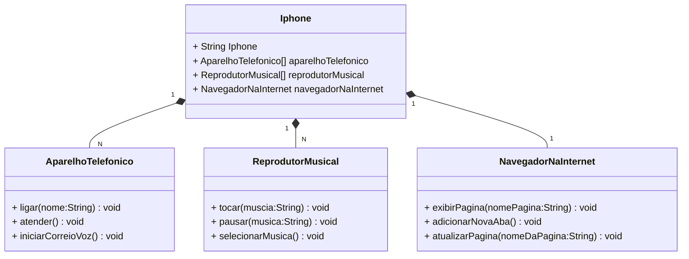

# Modelando Iphone em UML
Desafio D.I.O modelando iphone

## Diagrama de Classes UML

```mermaid

classDiagram
    class Iphone {
        + String Iphone
        + AparelhoTelefonico[] aparelhoTelefonico
        + ReprodutorMusical[] reprodutorMusical
        + NavegadorNaInternet navegadorNaInternet
    }

    class AparelhoTelefonico {
        + ligar(nome:String)void
        + atender()void
        + iniciarCorreioVoz()void
    }

    class ReprodutorMusical {
        + tocar(muscia:String)void
        + pausar(musica:String)void
        + selecionarMusica()void
    }

    class NavegadorNaInternet {
        + exibirPagina(nomePagina:String)void
        + adicionarNovaAba()void
        + atualizarPagina(nomeDaPagina:String)void
    }

    Iphone "1"*-- "N"AparelhoTelefonico
    Iphone "1"*--"N"ReprodutorMusical
    Iphone "1"*--"1"NavegadorNaInternet
```
